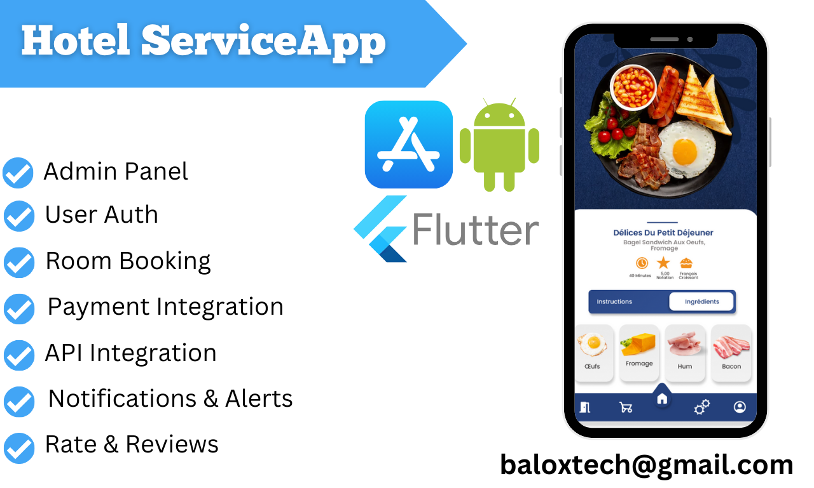
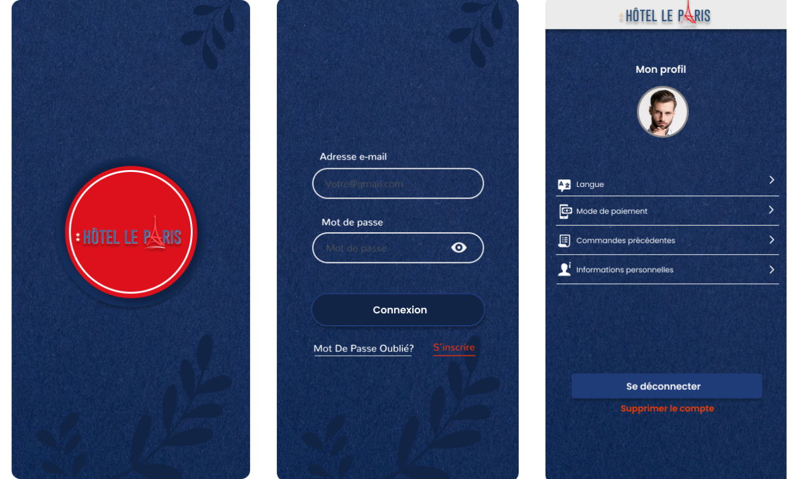
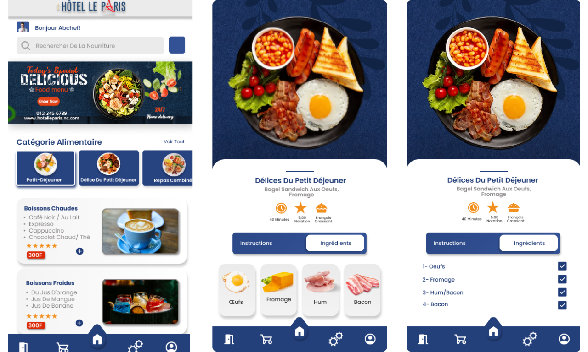
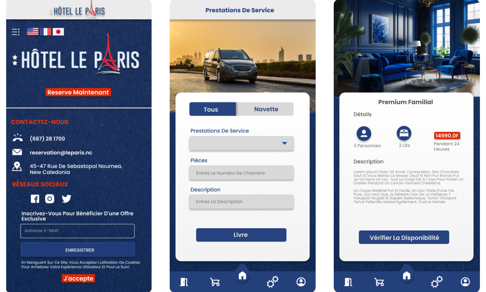

# Hotel Services App

## Overview
The **Hotel Services App** is a comprehensive platform designed to enhance the guest experience by providing a seamless way to manage hotel stays, book rooms, access amenities, and much more—all from a mobile device. This app is packed with features that cater to both guests and hotel management, ensuring an exceptional user experience.

## Screenshots

## Features

### 1. User Authentication & Profile Management
- **User Registration and Login:** Supports email, password authentication, and social media login.
- **Profile Management:** Users can edit their profiles, update contact details, and set preferences.

### 2. Room Booking System
- **Real-time Room Availability:** Users can check room availability based on their preferred dates and room types.
- **Detailed Room Information:** Includes images, amenities, pricing, and more.
- **Booking Process:** Simple and intuitive booking process with secure payment options.
- **Booking History:** Access past bookings and invoices at any time.

### 3. Payment Integration
- **Multiple Payment Methods:** Supports credit/debit cards, PayPal, and in-app wallet.
- **Secure Transactions:** SSL encryption for all payment transactions.
- **Invoices & Receipts:** Automatic generation and email delivery of invoices.

### 4. Hotel Services and Amenities Booking
- **Service Catalog:** Users can browse and book various hotel services like spa, gym, etc.
- **Customization Options:** Personalize services to fit user preferences.
- **Real-Time Updates:** Receive status updates for service bookings.

### 5. Location-Based Services
- **Interactive Map:** Shows hotel location and nearby attractions.
- **Navigation:** Turn-by-turn directions within the hotel premises.
- **Geofencing:** Get notifications and offers when near the hotel.

### 6. Push Notifications & Alerts
- **Booking Reminders:** Alerts for upcoming bookings and check-ins.
- **Promotional Notifications:** Personalized offers and promotions.
- **Service Updates:** Real-time notifications for service requests.

### 7. Reviews & Feedback
- **Rating System:** Users can rate their stay and services.
- **User Reviews:** Option to leave detailed feedback.
- **Admin Responses:** Hotel staff can respond to reviews.

### 8. Loyalty Program & Rewards
- **Rewards Points:** Earn points for bookings and service usage.
- **Redeemable Offers:** Redeem points for discounts or free services.
- **Loyalty Tiers:** Different tiers offering escalating benefits.

### 9. Multilingual Support
- **Language Selection:** Users can choose their preferred language.
- **Localized Content:** Translation of app content based on language settings.

### 10. Admin Panel & Hotel Management
- **Booking Management:** View and manage all bookings.
- **Service Management:** Manage available services and amenities.
- **User Management:** Monitor and manage user accounts.
- **Analytics & Reporting:** Detailed insights into bookings, revenue, and user behavior.
- **CMS Integration:** Manage app content, images, and promotions.

### 11. Security Features
- **Data Encryption:** Secure user data with encryption.
- **Two-Factor Authentication:** Enhanced security for user accounts.
- **Regular Security Audits:** Ensure app security through regular audits.

### 12. Customer Support & Chat Integration
- **In-App Chat:** Real-time chat support with hotel staff.
- **FAQ Section:** Comprehensive FAQ for common issues.
- **Support Ticketing:** Users can raise tickets for support and track resolution.

### 13. Offline Functionality
- **Basic Offline Access:** Access booking details and essential information without internet.
- **Sync on Reconnection:** Automatic data sync when internet is restored.

### 14. Performance Optimization
- **Fast Loading Times:** Optimized images, caching, and API calls for a smoother experience.
- **Scalability:** Built to handle a large number of users and bookings.
- **Error Handling:** User-friendly error messages for a better user experience.

